# DeepLearningPDE
Deep Learning for Partial Differential Equations
- [x] Training & testing with different meshgrids
- [x] Adam optimizer + Learning rate scheduler (L-BFGS is better)
- [x] Refinement 
## 1. Laplace equation with zero boundary
```python
python problem_Laplace.py
```
<p align="center">
  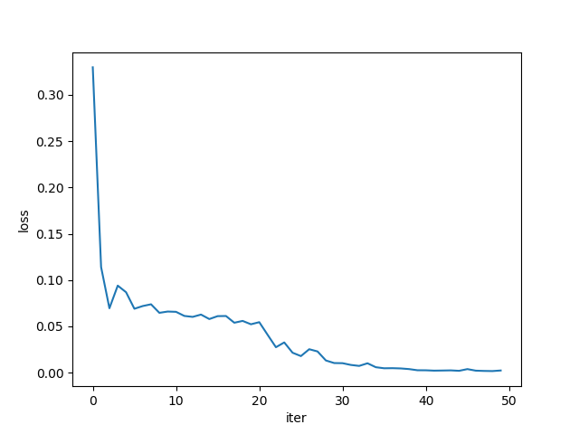
  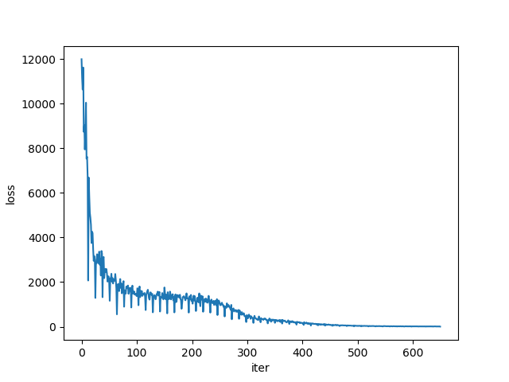
  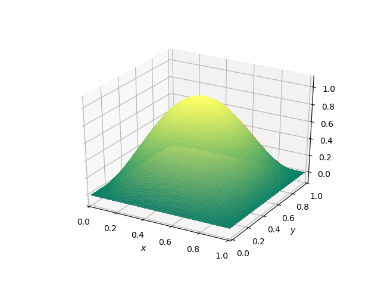
</p>

## 2. Heat Equation
```python
python problem_HeatEquation.py
```
<p align="center">
  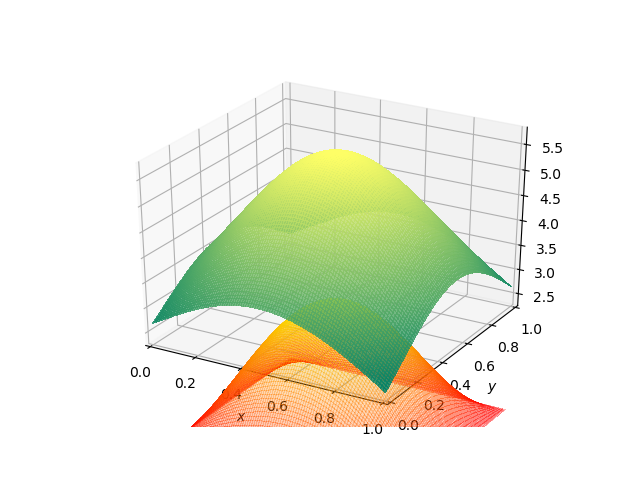
  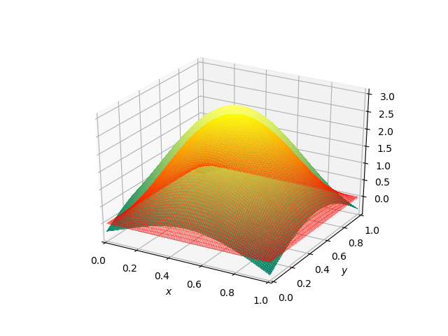
  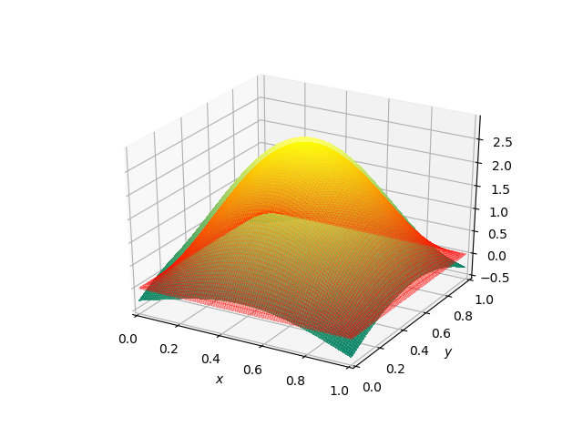
</p>

## 3. Steady Navier Stoke Equation
```python
python problem_steadyNavierStoke.py
```
<p align="center">
  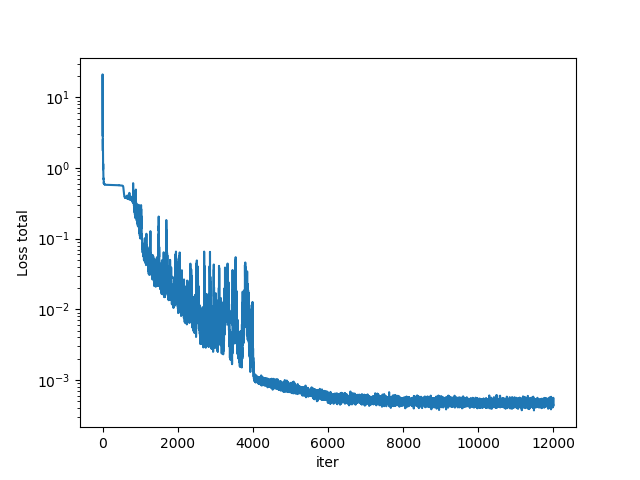
  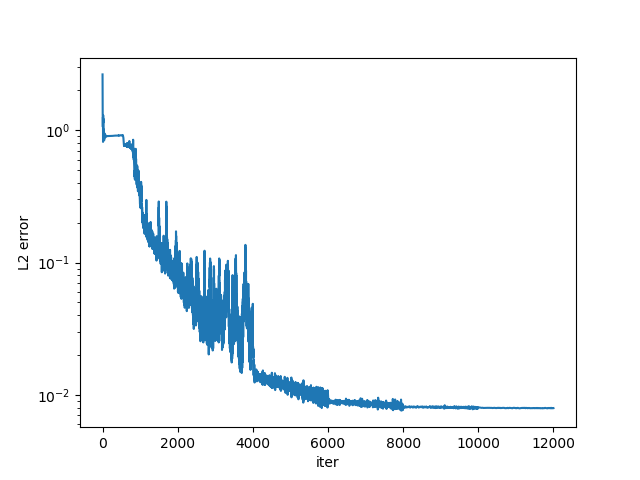
  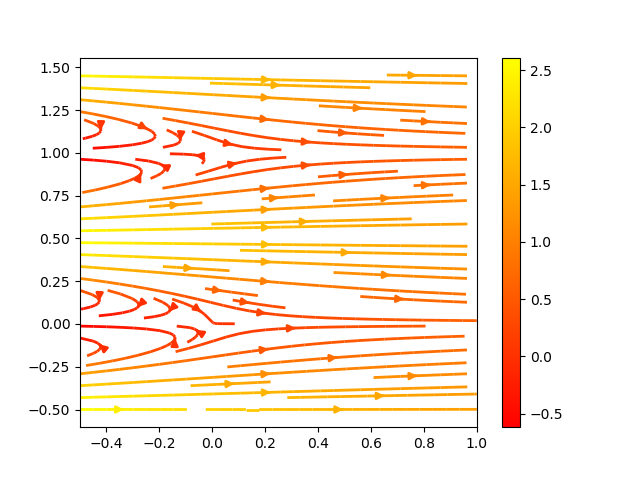
</p>

## 4. Navier Stoke Parameters Estimation
```python
python problem_NavierStokeEstimation.py
```
<p align="center">
  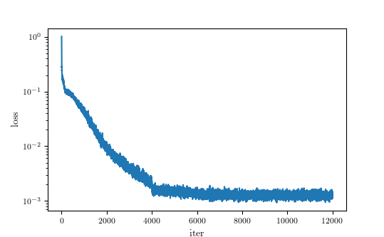
  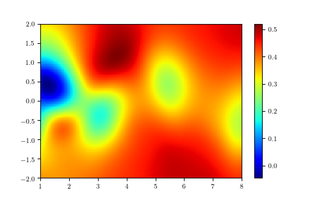
  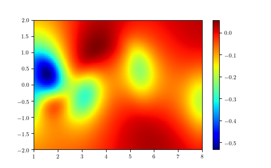
</p>


### Reference
[1] Kailai Xu, Bella Shi, Shuyi Yin. 2018. Deep learning for Partial Differential Equations (PDEs).
CS230.</br>
[2] Maziar Raissi, Paris Perdikaris, and George Em Karniadakis. Physics informed deep learning (part i): Data-driven solutions of nonlinear partial differential equations. arXiv preprint arXiv:1711.10561, 2017c.</br>
[3] Maziar Raissi, 2018a Deep hidden physics models: deep learning of nonlinear partial differential equations. arXiv:1801.06637.
